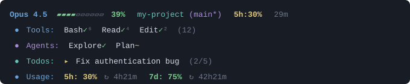
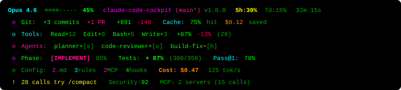
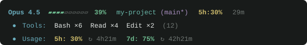
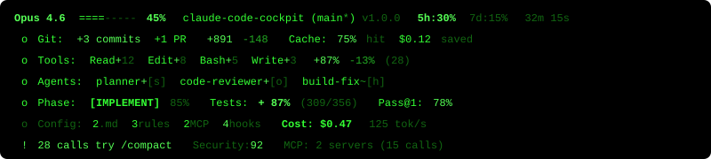

# Claude Code Cockpit

<div align="center">

> Claude Code를 위한 차세대 실시간 대시보드

[](https://github.com/baeseokjae/claude-code-cockpit)
[](./LICENSE)
[](#-개발)
[](https://nodejs.org)

[English](./README.md) • [한국어](./README.ko.md)

</div>

5가지 커스터마이징 가능한 테마, 종합 세션 모니터링, 제로 디펜던시를 갖춘 Claude Code용 고급 HUD 시스템입니다.

---

## 📑 목차

- [빠른 시작](#-빠른-시작)
- [기능](#-기능)
  - [핵심 기능](#핵심-기능)
  - [고급 기능](#고급-기능-v20)
- [설치](#-설치)
- [커맨드](#-커맨드)
- [테마](#-테마)
- [상세 기능](#-상세-기능)
- [설정](#️-설정)
- [스마트 알림](#-스마트-알림)
- [개발](#-개발)
- [프로젝트 구조](#-프로젝트-구조)
- [변경 로그](#-변경-로그)
- [영감을 받은 프로젝트](#-영감을-받은-프로젝트)
- [라이선스](#-라이선스)

---

## 🚀 빠른 시작

```bash
# 플러그인 설치
/plugin install claude-code-cockpit

# 상태표시줄 설정 (최초 1회)
/claude-code-cockpit:setup

# 대시보드 확인
/claude-code-cockpit:dashboard
```

완료! 이제 Claude Code 상태표시줄이 실시간 모니터링으로 강화되었습니다.

---

## ✨ 기능

### Claude Code Cockpit을 사용하는 이유

Claude Code Cockpit은 AI 기반 개발 세션의 **모든 측면을 실시간으로 가시화**하여 Claude Code 경험을 혁신합니다. 도구, 에이전트, 비용, 코드 품질을 모니터링하세요—모두 아름답고 커스터마이징 가능한 HUD에서.

### 핵심 기능

#### 🎨 비주얼 & 테마
- **5가지 프리미엄 테마**: Aurora(기본), Neon, Mono, Zen, Retro
- **반응형 레이아웃**: 터미널 너비에 따라 자동 조정 (3단계)
- **WCAG 준수**: 접근성 우선 색상 팔레트
- **터미널 하이퍼링크**: 클릭 가능한 파일 경로 및 GitHub URL
- **유니코드 & Nerd Font 지원**: 가능한 경우 아름다운 아이콘 표시

#### 🔧 실시간 모니터링
- **도구 추적**: Read, Edit, Bash, Grep 등 모든 도구 활동을 상태 표시와 함께 모니터링 (◐ 진행 중, ✓ 성공, ✗ 오류)
- **도구 통계**: 전체 도구 성공/실패율 (예: ✓87% ✗13%)
- **에이전트 추적**: 모델 표시와 함께 실시간 Task 서브에이전트 모니터링 ([h]aiku, [s]onnet, [o]pus)
- **Todo 진행률**: 완료 퍼센티지와 함께 TodoWrite 작업 상태 추적
- **Skill 추적**: /commit, /review-pr 등 Skill 호출 모니터링

#### 📊 Git 통합
- **브랜치 상태**: dirty 표시와 함께 현재 브랜치 표시
- **Git 활동**: 세션 중 생성된 커밋 및 PR 개수
- **Git 태그**: 브랜치 이름 옆에 최신 릴리즈 태그
- **파일 통계**: 수정/추가/삭제/미추적 파일 추적
- **모노레포 지원**: 여러 하위 디렉토리의 브랜치 표시
- **Worktree 지원**: 여러 git worktree 추적

#### 💰 비용 & 성능
- **비용 추정**: 모델별(Opus/Sonnet/Haiku) 토큰 기반 비용 계산
- **토큰 속도**: 입출력을 위한 실시간 tok/s 추적
- **캐시 메트릭**: 캐시 히트율 및 예상 절약 금액 표시
- **세션 시간**: 세션 실행 시간 추적
- **API 사용량**: 리셋 타이머와 함께 5시간 및 7일 사용량 한도 모니터링

#### 📝 코드 분석
- **라인 위젯**: 코드 추가/삭제 추적 (+152 -48)
- **Bash 오류 추적**: exit code와 함께 실패한 명령어 표시
- **설정 개수**: .claude.md, rules, MCP 서버, hooks 개수 표시

#### 🚨 스마트 알림
- **컨텍스트 경고**: 컨텍스트 사용량이 높을 때 알림 (75%+, 90%+)
- **비용 경고**: 비용이 임계값을 초과할 때 알림
- **세션 경고**: 장시간 실행 세션 알림 (30분+)
- **컴팩트 제안**: 도구 호출이 임계값을 초과할 때 `/compact` 권장

#### 🚀 기술적 우수성
- **제로 디펜던시**: Node.js 내장 모듈만 사용
- **빠른 성능**: < 50ms 렌더링 주기, < 50MB 메모리
- **321개 테스트 통과**: Vitest를 통한 포괄적인 테스트 커버리지
- **타입 안전**: TypeScript 5.x로 작성

### 고급 기능 (v2.0)

Claude Code Cockpit은 파워 유저를 위한 최첨단 분석 기능을 포함합니다:

#### 💡 지능형 제안
- **전략적 컴팩트 제안**: 도구 호출 수를 분석하여 임계값 초과 시 `/compact` 모드 제안 (예: `⚠️ 75 calls try /compact`)
- **컨텍스트 최적화**: 컨텍스트 윈도우 고갈 방지 지원

#### 🔍 코드 품질 & 보안
- **규칙 위반 감지**: 실시간 감지:
  - 하드코딩된 시크릿 (API 키, 토큰, 자격 증명)
  - Console.log 및 디버그 문
  - 대용량 파일 (>1MB)
  - TODO/FIXME 주석
  - 심각도 기반 아이콘 (🔴 치명적, 🟡 중간, 🔵 낮음)

#### 🔄 워크플로우 인텔리전스
- **워크플로우 단계 감지**: PLAN/IMPLEMENT/REVIEW 단계 자동 감지
  - 패턴을 위한 최근 20개 도구 호출 분석
  - 신뢰도 점수 (0-100%)
  - Todo 상태 통합
  - `[PLAN]`, `[IMPLEMENT]`, 또는 `[REVIEW]`로 표시

#### 🧪 테스트 & 품질 메트릭
- **테스트 커버리지 분석**: 프레임워크 독립적 커버리지 표시
  - 자동 감지: vitest, jest, mocha, ava
  - 표시: statements, branches, functions, lines
  - 색상 코딩: 초록색 (80%+), 노란색 (60-79%), 빨간색 (<60%)
- **Pass@k 메트릭**: AI 코드 생성 품질 측정
  - Pass@1: 첫 시도 성공률
  - Pass@3: 3번 이내 성공
  - Pass@5: 5번 이내 성공
  - 평균 성공 시도 횟수
  - 최근 성공률 (최근 10개 시퀀스)

#### 🔌 MCP (Model Context Protocol)
- **MCP 상태**: 서버별 도구 사용량 통계
  - MCP 서버별 도구 호출 추적
  - 서버별 성공률
  - 가장 많이 사용된 MCP 도구 식별
  - 표시: `MCP: 3 servers (45 calls)`
- **MCP 영향 추적**: 설정 및 도구 개수 추정
- **성능 메트릭**: 빌드 및 테스트 성능 추적 (실험적)

#### 🌳 고급 Git 기능
- **Git Worktree 지원**: 여러 worktree 추적
  - 모든 git worktree 감지
  - 경로, 브랜치, 커밋, dirty 상태 표시
  - 표시: `3 worktrees (1 dirty)`

#### 🔗 멀티 인스턴스 지원
- **인스턴스 동기화**: 멀티 인스턴스 동기화 (기본 구조, 실험적)
  - 인스턴스 검색
  - 현재 인스턴스 추적

---

## 🚀 설치

### 사전 요구사항

- **Claude Code**: 버전 2.0+ 필요
- **Node.js**: 버전 18.0.0 이상
- **터미널**: ANSI 색상 지원이 있는 최신 터미널 (권장: iTerm2, VSCode Terminal, Windows Terminal, Kitty)

### 방법 1: 마켓플레이스에서 설치 (권장)

Claude Code Cockpit을 설치하는 가장 쉬운 방법:

```bash
# Claude Code 내에서 실행:
/plugin install claude-code-cockpit

# 상태표시줄 설정 (최초 1회)
/claude-code-cockpit:setup

# 설치 확인
/claude-code-cockpit:dashboard
```

### 방법 2: 수동 설치

수동 설치 또는 기여를 위해:

```bash
# 저장소 클론
git clone https://github.com/baeseokjae/claude-code-cockpit.git
cd claude-code-cockpit

# 의존성 설치
pnpm install

# TypeScript 빌드
pnpm build

# 테스트 실행 (선택사항)
pnpm test

# 로컬에 설치
pnpm link --global
```

그런 다음 Claude Code에서:
```bash
/plugin install <클론한-저장소-경로>
/claude-code-cockpit:setup
```

### 방법 3: 개발 모드

활발한 개발을 위해:

```bash
# 프로젝트 디렉토리에서
pnpm dev  # 워치 모드

# 다른 터미널에서 로컬 테스트
cc --plugin-dir .

# 또는 stdin 직접 테스트
echo '{"model":{"display_name":"Opus"}}' | node dist/index.js
```

---

## 📋 커맨드

Claude Code Cockpit은 상세한 세션 모니터링 및 설정을 위한 **7개의 대화형 커맨드**를 제공합니다. 모든 커맨드는 세션 중에 자동으로 업데이트되는 `/tmp/cockpit-session.md`를 읽습니다.

### 세션 모니터링 커맨드

#### `/claude-code-cockpit:dashboard`
**모든 통계를 포함한 종합 세션 대시보드 표시**

다음을 포함한 현재 세션의 완전한 개요 표시:
- 모델 및 세션 정보
- 토큰 사용량 및 비용
- 상태와 함께 모든 도구 호출
- 에이전트 실행
- 할일 목록 진행률
- Skill 호출
- Git 상태 및 활동
- API 사용량 한도
- 고급 메트릭 (워크플로우 단계, 테스트 커버리지, Pass@k 등)

**출력 예시:**
```markdown
# Claude Code 세션 대시보드

## 세션 정보
- 모델: Opus 4.6
- 세션: groovy-juggling-acorn
- 시간: 15분 32초
- 비용: $0.47

## 도구 (87% 성공률)
- Read: 12회 호출 (✓11 ✗1)
- Edit: 8회 호출 (✓8 ✗0)
- Bash: 5회 호출 (✓3 ✗2)
...
```

#### `/claude-code-cockpit:tools`
**상세한 도구 사용량 통계 및 기록 표시**

세부적인 도구 사용 데이터 표시:
- 도구 호출 횟수
- 도구별 성공/실패율
- 최근 도구 기록
- 실패한 호출의 오류 세부사항

#### `/claude-code-cockpit:agents`
**에이전트 실행 세부사항 및 상태 표시**

세션 중 생성된 모든 Task 서브에이전트 나열:
- 에이전트 이름 및 설명
- 사용된 모델 (Haiku/Sonnet/Opus)
- 상태 (진행 중, 완료, 실패)
- 실행 시간
- 출력 요약

#### `/claude-code-cockpit:todos`
**완료 상태와 함께 할일 목록 표시**

TodoWrite 작업 진행률 표시:
- 완료 체크박스가 있는 작업 목록
- 전체 완료 퍼센티지
- 작업 설명 및 상태
- 계층적 작업 구조

#### `/claude-code-cockpit:usage`
**API 사용량 통계 및 사용량 한도 표시**

API 사용량 정보 표시:
- 5시간 사용량 창 (요청, 토큰)
- 7일 사용량 창 (요청, 토큰)
- 각 창의 사용 퍼센티지
- 리셋까지 남은 시간
- 모델별 비용 분석

### 설정 커맨드

#### `/claude-code-cockpit:setup`
**Claude Code 상태표시줄 설정 (최초 1회)**

`~/.claude/settings.json`을 자동으로 설정하여 claude-code-cockpit을 상태표시줄 플러그인으로 사용합니다. 설치 후 필요합니다.

**수행 작업:**
1. 현재 설정 읽기
2. `statusline` 설정 업데이트
3. 기존 설정 백업
4. 새 설정 작성

**예시:**
```json
{
  "statusline": {
    "enabled": true,
    "command": "node ~/.claude/plugins/claude-code-cockpit/dist/index.js"
  }
}
```

#### `/claude-code-cockpit:configure`
**테마 및 표시 옵션을 대화형으로 설정**

cockpit 커스터마이징을 위한 대화형 설정 마법사:
- **테마 선택**: 5가지 테마 중 선택 (Aurora, Neon, Mono, Zen, Retro)
- **상세 모드**: 상세 모드 활성화/비활성화
- **표시 옵션**: 개별 위젯 토글 (도구, 에이전트, 할일, skill 등)
- **고급 기능**: v2.0 기능 활성화/비활성화 (워크플로우 단계, 테스트 커버리지, Pass@k 등)
- **성능 설정**: 추적할 최대 도구/에이전트 설정

**사용법:**
```bash
/claude-code-cockpit:configure

# 커맨드가 다음을 안내합니다:
# 1. 테마 선택 (aurora/neon/mono/zen/retro)
# 2. 상세 모드 활성화? (y/n)
# 3. git 상태 표시? (y/n)
# 4. 도구 표시? (y/n)
# ... (모든 옵션에 대해 계속)
```

설정은 `~/.claude/plugins/claude-code-cockpit/config.json`에 저장됩니다.

---

## 🎨 테마

Claude Code Cockpit은 각각 고유한 미학과 WCAG 준수 색상 팔레트로 신중하게 설계된 **5가지 프리미엄 테마**를 제공합니다.

### 🌌 Aurora (기본)
**오로라에서 영감**

초록-청록-보라 오로라 그라데이션이 있는 극지방 밤하늘. 보석 톤 강조가 있는 균형 잡힌 대비.

**적합한 용도:** 일반 사용, 장시간 세션, 눈 편안함



---

### ⚡ Neon
**사이버펑크 네온 사인 미학**

깊은 검은색 위의 고대비 형광 초록, 시안, 핫핑크. 대담하고 생동감 있음.

**적합한 용도:** 높은 가시성, 어두운 환경, 최신 터미널



---

### ⚫ Mono
**순수 흑백 미니멀**

ASCII 호환, 접근성 우선 설계. 색상 없음, 최대 호환성.

**적합한 용도:** 접근성, 레거시 터미널, 전자잉크 디스플레이, 최소 방해


---

### 🧘 Zen
**초미니멀 고요함**

전통 종이와 먹에서 영감받은 차분한 대지 톤. 섬세하고 세련됨.

**적합한 용도:** 집중 작업, 시각적 노이즈 감소, 차분한 환경



---

### 📺 Retro
**80년대 CRT 인광 모니터 향수**

검은색 위의 녹색 인광 광채. 클래식 터미널 미학.

**적합한 용도:** 레트로 애호가, 빈티지 터미널 느낌, 향수



---

### 테마 전환

**방법 1: 대화형 (권장)**
```bash
/claude-code-cockpit:configure
# 테마 선택: aurora, neon, mono, zen, 또는 retro
```

**방법 2: 환경 변수**
```bash
export COCKPIT_THEME=neon
```

**방법 3: 설정 파일**
`~/.claude/plugins/claude-code-cockpit/config.json` 편집:
```json
{
  "theme": "zen"
}
```

### 테마 비교

| 테마 | 대비 | 색상 | 사용 사례 | 접근성 |
|------|------|------|-----------|--------|
| **Aurora** | 중간 | 🌈 다색상 | 일반, 균형 | ✅ WCAG AA |
| **Neon** | 높음 | 🎨 밝은 네온 | 고가시성, 다크모드 | ✅ WCAG AAA |
| **Mono** | 높음 | ⚫⚪ 흑백만 | 최대 호환 | ✅ WCAG AAA |
| **Zen** | 낮음 | 🎨 대지 톤 | 집중, 미니멀 | ✅ WCAG AA |
| **Retro** | 중간 | 💚 녹색 단색 | 향수 | ✅ WCAG AA |

---

## 🌟 상세 기능

### 실시간 모니터링
- **세션 시간 추적** - 현재 세션이 실행된 시간 추적
- **토큰 사용량** - 입력/출력/캐시 토큰을 실시간으로 모니터링
- **비용 계산** - 모델 및 토큰 사용량에 따른 자동 비용 추정
- **API 사용량 한도 모니터링** - 리셋 타이머와 함께 5시간 및 7일 API 사용량 창 추적

### 대화형 커맨드
- **종합 대시보드** - 전체 세션 개요를 위한 `/claude-code-cockpit:dashboard`
- **도구 사용량 통계** - 상세한 도구 호출 기록을 위한 `/claude-code-cockpit:tools`
- **에이전트 실행 추적** - 서브에이전트 상태 및 설명을 위한 `/claude-code-cockpit:agents`
- **할일 목록 모니터링** - 작업 진행률 추적을 위한 `/claude-code-cockpit:todos`
- **API 사용량 분석** - 사용량 한도 및 사용량 통계를 위한 `/claude-code-cockpit:usage`

### 토큰 속도 추적
- **출력 토큰 생성 속도** - 실시간 tok/s 계산
- **입력 토큰 처리 속도** - 입력 처리 속도 모니터링
- **설정 가능한 표시** - `showTokenSpeed` 옵션으로 토글

### Git 통합
- **현재 브랜치 및 dirty 상태** - 커밋되지 않은 변경사항 표시와 함께 현재 git 브랜치 확인
- **최신 태그 표시** - 브랜치 이름 옆에 가장 최근 git 태그 표시
- **파일 수정 통계** - 수정/추가/삭제/미추적 파일 개수 추적
- **모노레포 지원** - 여러 하위 디렉토리의 브랜치 표시
- **클릭 가능한 GitHub 링크** - GitHub 브랜치 페이지로 연결되는 터미널 의존 하이퍼링크

### 라인 위젯
- **코드 변경 추적** - 추가/삭제된 라인 표시 (+152 -48)
- **컴팩트 형식** - 가독성을 위해 큰 숫자는 5.0k로 표시
- **설정 가능한 표시** - `showLines` 옵션으로 토글

### 캐시 메트릭
- **캐시 히트율** - 캐시 읽기에서 온 입력 비율
- **예상 절약 금액** - 프롬프트 캐싱으로 절약된 비용
- **모델 인식 가격** - Sonnet, Opus, Haiku 가격 지원
- **설정 가능한 표시** - `showCacheMetrics` 옵션으로 토글

### 터미널 하이퍼링크
- **클릭 가능한 파일 경로** - file:// 프로토콜 링크를 위한 OSC 8 escape sequence
- **클릭 가능한 GitHub URL** - GitHub 브랜치 페이지로 직접 연결
- **자동 호환성 감지** - 터미널 하이퍼링크 지원의 스마트 감지
- **지원 터미널**: iTerm2, Apple Terminal, VSCode Terminal, Kitty, Windows Terminal, Ghostty

### 세션 파일 내보내기
- **자동 생성 세션 요약** - `/tmp/cockpit-session.md`에 Markdown 파일
- **모든 커맨드에서 사용** - 모든 `/claude-code-cockpit:*` 커맨드가 이 파일 읽기
- **종합 데이터** - 도구, 에이전트, 할일, 사용량 통계, git 상태 포함

### 고급 분석 기능 (v2.0)

#### 워크플로우 단계 감지
- **자동 단계 감지** - 도구 패턴을 분석하여 PLAN/IMPLEMENT/REVIEW 단계 감지
- **신뢰도 점수** - 감지된 단계의 신뢰도 퍼센티지 표시
- **도구 패턴 분석** - 단계를 결정하기 위해 최근 20개 도구 호출 사용
- **Todo 상태 통합** - 단계 결정을 위해 할일 완료 고려

#### 테스트 커버리지 분석
- **프레임워크 자동 감지** - vitest, jest, mocha, ava 지원
- **커버리지 메트릭** - statements, branches, functions, lines 표시
- **색상 코딩** - 초록색 (80%+), 노란색 (60-79%), 빨간색 (<60%)

#### Pass@k 메트릭
- **AI 품질 측정** - 코드 생성 성공률 추적
- **여러 k 값** - Pass@1 (첫 시도), Pass@3 (3번 이내), Pass@5 (5번 이내)
- **평균 시도 횟수** - 성공에 필요한 평균 시도 횟수 표시
- **최근 성공률** - 최근 10번 시도의 성공 추적

---

## ⚙️ 설정

Claude Code Cockpit은 고도로 설정 가능합니다. 대화형 마법사, 설정 파일 또는 환경 변수를 통해 모든 측면을 커스터마이즈할 수 있습니다.

### 빠른 설정

**권장: 대화형 마법사**
```bash
/claude-code-cockpit:configure
```

이 커맨드는 명확한 프롬프트 및 설명과 함께 모든 설정 옵션을 안내합니다.

### 환경 변수

설정 파일을 편집하지 않고 빠른 재정의를 위해:

```bash
# 테마 선택
export COCKPIT_THEME=aurora        # 옵션: aurora, neon, mono, zen, retro

# Preset 선택 (표시 설정 묶음 적용)
export COCKPIT_PRESET=developer    # 옵션: minimal, developer, full

# 상세 모드 활성화 (고급 기능)
export COCKPIT_DETAIL=1            # 0=끔, 1=켬

# 경로 표시 깊이
export COCKPIT_PATH_LEVELS=2       # 표시할 디렉토리 레벨 수
```

이러한 환경 변수는 설정 파일 설정보다 우선합니다.

### 설정 파일

`~/.claude/plugins/claude-code-cockpit/config.json`:

```json
{
  "theme": "aurora",
  "preset": "developer",
  "detailMode": false,
  "pathLevels": 1,
  "rightMargin": 2,
  "maxActivityWidgets": 8,
  "display": {
    "showGit": true,
    "showTools": true,
    "showAgents": true,
    "showTodos": true,
    "showSkills": false,
    "showUsage": true,
    "showConfigCounts": false,
    "showCost": true,
    "showAbsoluteTokens": false,
    "showSessionName": true,
    "showTokenSpeed": false,
    "showGitFileStats": false,
    "showAllBranches": false,
    "showAllBranchesDepth": 2,
    "showLines": true,
    "showCacheMetrics": false,
    "showGitTag": false,
    "showGitActivity": false,
    "showToolStats": false,
    "showBashErrors": true,
    "showCompactSuggestion": true,
    "showViolations": true,
    "showMcpImpact": false,
    "showWorkflowPhase": false,
    "showTestCoverage": false,
    "showPassAtK": false,
    "showGitWorktrees": false,
    "showPerformanceMetrics": false,
    "showMcpStatus": false,
    "showInstanceSync": false,
    "sevenDayThreshold": 80
  },
  "usage": {
    "enabled": true,
    "cacheMinutes": 10
  },
  "notifications": {
    "enabled": false,
    "compactWarningThreshold": 75,
    "compactSuggestionEnabled": true,
    "compactSuggestionThreshold": 50
  },
  "performance": {
    "maxTools": 20,
    "maxAgents": 20
  }
}
```

### Presets

Preset은 미리 정의된 표시 설정 묶음을 적용합니다. 개별 표시 옵션은 여전히 preset 값을 재정의할 수 있습니다.

| Preset | 설명 |
|--------|------|
| `minimal` | 핵심만: 모델, 컨텍스트%, 비용, 시간. 대부분의 위젯 꺼짐 |
| `developer` | 기본 + gitActivity, toolStats 활성화 |
| `full` | 모든 표시 옵션 활성화 |

설정 파일(`"preset": "developer"`) 또는 환경 변수(`COCKPIT_PRESET=developer`)를 통해 설정.

**우선순위:** 기본값 → Preset → 사용자 재정의

### 표시 옵션

모든 표시 옵션을 개별적으로 토글할 수 있습니다. 다음은 완전한 참조입니다:

#### 기본 표시

| 옵션 | 기본값 | 설명 |
|------|--------|------|
| `showGit` | ✅ true | Git 브랜치 및 상태 |
| `showTools` | ✅ true | 도구 사용량 (Read, Edit, Bash 등) |
| `showAgents` | ✅ true | 에이전트 실행 상태 |
| `showTodos` | ✅ true | Todo 진행률 추적 |
| `showSkills` | ❌ false | Skill 호출 (/commit, /review-pr) |
| `showUsage` | ✅ true | API 사용량 통계 |
| `showCost` | ✅ true | 비용 추정 |

#### 토큰 & 세션 표시

| 옵션 | 기본값 | 설명 |
|------|--------|------|
| `showAbsoluteTokens` | ❌ false | 퍼센티지 대신 절대 토큰 수 표시 |
| `showTokenSpeed` | ❌ false | 토큰 생성 속도 (tok/s) |
| `showSessionName` | ✅ true | 상태 표시줄의 세션/플랜 이름 |

#### Git 정보

| 옵션 | 기본값 | 설명 |
|------|--------|------|
| `showGitTag` | ❌ false | 브랜치 옆 최신 git 태그 |
| `showGitActivity` | ❌ false | 세션 중 생성된 커밋 및 PR |
| `showGitFileStats` | ❌ false | 수정/추가/삭제된 파일 개수 |
| `showAllBranches` | ❌ false | 하위 디렉토리의 브랜치 (모노레포) |
| `showAllBranchesDepth` | 2 | 하위 디렉토리 스캔 최대 깊이 |
| `showGitWorktrees` | ❌ false | Git worktree 상태 (고급) |

#### 코드 메트릭

| 옵션 | 기본값 | 설명 |
|------|--------|------|
| `showLines` | ✅ true | 코드 추가/삭제 (+152 -48) |
| `showCacheMetrics` | ❌ false | 캐시 히트율 및 절약 금액 |
| `showConfigCounts` | ❌ false | .claude.md, rules, MCP, hooks 개수 |

#### 활동 추적

| 옵션 | 기본값 | 설명 |
|------|--------|------|
| `showToolStats` | ❌ false | 전체 도구 성공/실패율 |
| `showBashErrors` | ✅ true | exit code와 함께 실패한 bash 명령어 |

#### 고급 분석 (v2.0)

| 옵션 | 기본값 | 설명 |
|------|--------|------|
| `showCompactSuggestion` | ✅ true | 임계값 초과 시 `/compact` 제안 |
| `showViolations` | ✅ true | 코드 위반 (시크릿, console.log) |
| `showMcpImpact` | ❌ false | MCP 서버 설정 및 도구 개수 |
| `showWorkflowPhase` | ❌ false | 현재 워크플로우 단계 (PLAN/IMPLEMENT/REVIEW) |
| `showTestCoverage` | ❌ false | 테스트 커버리지 퍼센티지 |
| `showPassAtK` | ❌ false | Pass@k 코드 생성 품질 메트릭 |
| `showMcpStatus` | ❌ false | MCP 서버 사용량 통계 |
| `showPerformanceMetrics` | ❌ false | 빌드/테스트 성능 (실험적) |
| `showInstanceSync` | ❌ false | 멀티 인스턴스 동기화 (실험적) |

#### 사용량 경고

| 옵션 | 기본값 | 설명 |
|------|--------|------|
| `sevenDayThreshold` | 80 | 7일 사용량 경고 표시 퍼센티지 임계값 (0-100) |

### 알림 옵션

| 옵션 | 기본값 | 설명 |
|------|--------|------|
| `enabled` | ❌ false | 데스크톱 알림 활성화 (실험적) |
| `compactWarningThreshold` | 75 | 컴팩트 경고를 위한 컨텍스트 퍼센티지 |
| `compactSuggestionEnabled` | ✅ true | `/compact` 제안 활성화 |
| `compactSuggestionThreshold` | 50 | 제안을 트리거하는 도구 호출 수 |

### 사용량 옵션

| 옵션 | 기본값 | 설명 |
|------|--------|------|
| `enabled` | ✅ true | API 사용량 추적 활성화 |
| `cacheMinutes` | 10 | 사용량 데이터 캐시 지속 시간(분) |

### 성능 옵션

| 옵션 | 기본값 | 설명 |
|------|--------|------|
| `maxTools` | 20 | 추적할 최대 도구 수 |
| `maxAgents` | 20 | 추적할 최대 에이전트 수 |

**참고:** `maxTools` 및 `maxAgents`를 줄이면 느린 시스템이나 매우 긴 세션에서 성능을 향상시킬 수 있습니다.

### 추가 옵션

| 옵션 | 기본값 | 설명 |
|------|--------|------|
| `rightMargin` | 2 | 터미널 줄바꿈 방지를 위해 예약된 오른쪽 여백 열 |
| `maxActivityWidgets` | 8 | 라인당 최대 활동 위젯 수 |
| `pathLevels` | 1 | 프로젝트 경로에 표시할 상위 디렉토리 레벨 수 |

### 예시 설정 프리셋

#### 미니멀 (성능 중심)
```json
{
  "theme": "mono",
  "detailMode": false,
  "display": {
    "showGit": true,
    "showTools": true,
    "showAgents": false,
    "showTodos": false,
    "showSkills": false,
    "showUsage": false,
    "showCost": true,
    "showCompactSuggestion": false,
    "showViolations": false,
    "showWorkflowPhase": false,
    "showTestCoverage": false,
    "showPassAtK": false
  },
  "performance": {
    "maxTools": 10,
    "maxAgents": 5
  }
}
```

#### 전체 기능 (파워 유저)
```json
{
  "theme": "aurora",
  "preset": "full",
  "detailMode": true,
  "display": {
    "showGit": true,
    "showTools": true,
    "showAgents": true,
    "showTodos": true,
    "showSkills": true,
    "showUsage": true,
    "showCost": true,
    "showCompactSuggestion": true,
    "showViolations": true,
    "showMcpImpact": true,
    "showWorkflowPhase": true,
    "showTestCoverage": true,
    "showPassAtK": true,
    "showMcpStatus": true,
    "showGitActivity": true,
    "showToolStats": true,
    "showBashErrors": true
  },
  "performance": {
    "maxTools": 50,
    "maxAgents": 50
  }
}
```

#### 보안 중심
```json
{
  "theme": "neon",
  "detailMode": true,
  "display": {
    "showViolations": true,
    "showBashErrors": true,
    "showMcpImpact": false,
    "showWorkflowPhase": false
  }
}
```

---

## 🚨 스마트 알림

Claude Code Cockpit은 중요한 임계값에 대해 경고하는 지능형 알림 시스템을 포함합니다:

### 컨텍스트 사용량 알림

| 알림 수준 | 임계값 | 표시 | 설명 |
|----------|--------|------|------|
| 🔴 **치명적** | 90%+ | `⚠ CTX 95%!` (빨간색 볼드) | 컨텍스트 윈도우 거의 가득 참, `/compact` 고려 |
| 🟡 **경고** | 75-89% | `⚠ CTX 80%` (노란색) | 컨텍스트 사용량 높음, 곧 컴팩션 계획 |
| 🟢 **정상** | < 75% | 표준 표시 | 컨텍스트 사용량 건강함 |

### 비용 알림

| 알림 수준 | 임계값 | 표시 | 설명 |
|----------|--------|------|------|
| 💰 **높은 비용** | $1.00+ | 비용 강조 표시 | 세션 비용이 $1 초과 |
| 💵 **중간 비용** | $0.50-$0.99 | 비용 표시 | 세션 비용 보통 |
| 💚 **낮은 비용** | < $0.50 | 표준 표시 | 세션 비용 낮음 |

### 세션 시간 알림

| 알림 수준 | 임계값 | 표시 | 설명 |
|----------|--------|------|------|
| ⏰ **긴 세션** | 30분+ | 세션 시간 강조 표시 | 긴 세션의 경우 휴식 고려 |
| 🔴 **매우 긴 세션** | 60분+ | 세션 시간 빨간색 | 매우 긴 세션, 체크포인트 고려 |

### 컴팩트 모드 제안

`showCompactSuggestion`이 활성화된 경우:

| 조건 | 표시 | 동작 |
|------|------|------|
| 도구 호출 > 임계값 | `⚠️ 75 calls try /compact` | 컨텍스트를 줄이기 위해 `/compact` 실행 제안 |

**기본 임계값:** 50 도구 호출 (`compactSuggestionThreshold`로 설정 가능)

### API 사용량 알림

사용량이 한도에 접근할 때 표시:

| 창 | 임계값 | 표시 |
|----|--------|------|
| 5시간 | 80%+ | `⚠️ 5h:85%` 노란색/빨간색 |
| 7일 | 80%+ | `⚠️ 7d:89%` 노란색/빨간색 |

**참고:** API 사용량 알림은 설정에서 `showUsage: true`가 필요합니다.

### 알림 커스터마이즈

`~/.claude/plugins/claude-code-cockpit/config.json` 편집:

```json
{
  "notifications": {
    "enabled": false,
    "compactWarningThreshold": 75,        // 경고를 위한 컨텍스트 %
    "compactSuggestionEnabled": true,      // /compact 제안 활성화
    "compactSuggestionThreshold": 50       // 제안 전 도구 호출 수
  },
  "display": {
    "sevenDayThreshold": 80                // 7일 사용량 표시 전 %
  }
}
```

---

## 📦 개발

### 시작하기

1. **클론 및 설치**
```bash
git clone https://github.com/baeseokjae/claude-code-cockpit.git
cd claude-code-cockpit
pnpm install
```

2. **빌드 및 워치**
```bash
# 한 번 빌드
pnpm build

# 워치 모드 (변경 시 자동 재빌드)
pnpm dev
```

3. **테스트 실행**
```bash
# 모든 테스트 실행
pnpm test

# 워치 모드
pnpm test:watch

# 커버리지 보고서
pnpm test:coverage

# 스냅샷 업데이트
pnpm test:update-snapshots
```

### 테스트

Claude Code Cockpit은 27개 테스트 파일에 걸쳐 321개 테스트로 **포괄적인 테스트 커버리지**를 가지고 있습니다:

| 테스트 스위트 | 테스트 수 | 커버리지 |
|--------------|----------|----------|
| **단위 테스트** | 270+ | 핵심 기능 |
| **통합 테스트** | 16 | 엔드투엔드 시나리오 |
| **테마 테스트** | 25 | 모든 5가지 테마 |

**테스트 카테고리:**
- `tests/unit/` - 개별 모듈을 위한 단위 테스트
- `tests/integration/` - 통합 테스트
- `tests/*.test.ts` - 기능별 테스트 (git, cache, workflow 등)

**특정 테스트 실행:**
```bash
# 특정 테스트 파일 실행
pnpm test tests/theme-helpers.test.ts

# 패턴으로 실행
pnpm test --grep "workflow"

# 디버그 모드
DEBUG=* pnpm test
```

### 수동 테스트

샘플 stdin으로 상태표시줄 테스트:

```bash
# 기본 테스트
echo '{"model":{"display_name":"Opus"},"context_window":{"used_percentage":45},"cwd":"/test"}' | node dist/index.js

# 디버그 모드 (내부 로깅 표시)
echo '{"model":{"display_name":"Opus"}}' | DEBUG=* node dist/index.js

# transcript와 함께 테스트
echo '{"model":{"display_name":"Sonnet"},"transcript_path":"./tests/fixtures/sample.jsonl","cwd":"/test"}' | node dist/index.js
```

### 테마 미리보기

Claude Code를 실행하지 않고 모든 테마 미리보기:

```bash
pnpm preview:themes
```

이것은 모든 5가지 테마에 대한 샘플 출력을 나란히 생성합니다.

### 타입 체크

```bash
# 빌드하지 않고 타입 체크
pnpm lint
```

### 디버깅

`DEBUG` 환경 변수로 디버그 로깅 활성화:

```bash
# 모든 디버그 출력
DEBUG=* node dist/index.js < sample.json

# 특정 모듈
DEBUG=main,git,transcript node dist/index.js < sample.json

# 사용 가능한 디버그 네임스페이스:
# - main: 메인 진입점
# - git: Git 작업
# - transcript: Transcript 파싱
# - config: 설정 로딩
# - theme: 테마 렌더링
# - usage: API 사용량 가져오기
```

### 아키텍처

상세한 기술 문서는 [ARCHITECTURE.md](./docs/ARCHITECTURE.md)를 참조하세요:
- 시스템 아키텍처
- 데이터 흐름
- 테마 시스템
- 성능 최적화
- 플러그인 API

### 기여하기

기여를 환영합니다! 다음 가이드라인을 따라주세요:

1. **저장소 포크 및 클론**
2. **기능을 위한 브랜치 생성** (`git checkout -b feature/amazing-feature`)
3. **변경사항에 대한 테스트 작성**
4. **테스트 통과 확인** (`pnpm test`)
5. **타입 체크** (`pnpm lint`)
6. **명확한 메시지로 변경사항 커밋**
7. **포크로 푸시** 및 **Pull Request 생성**

**코드 스타일:**
- TypeScript 사용
- 기존 코드 규칙 따르기
- 공개 API에 JSDoc 주석 추가
- 새 기능에 대한 테스트 작성
- 필요에 따라 문서 업데이트

**Pull Request 체크리스트:**
- [ ] 테스트 통과 (`pnpm test`)
- [ ] 타입 체크 통과 (`pnpm lint`)
- [ ] 문서 업데이트
- [ ] CHANGELOG.md 업데이트 (해당하는 경우)
- [ ] 기존 코드 스타일 준수

---

## 📁 프로젝트 구조

```
claude-code-cockpit/
├── .claude-plugin/          # 플러그인 메타데이터
│   └── plugin.json          # 플러그인 매니페스트 (이름, 버전, 커맨드)
│
├── commands/                # 대화형 커맨드 스크립트
│   ├── dashboard.md         # /claude-code-cockpit:dashboard
│   ├── tools.md             # /claude-code-cockpit:tools
│   ├── agents.md            # /claude-code-cockpit:agents
│   ├── todos.md             # /claude-code-cockpit:todos
│   ├── usage.md             # /claude-code-cockpit:usage
│   ├── setup.md             # /claude-code-cockpit:setup
│   └── configure.md         # /claude-code-cockpit:configure
│
├── src/                     # 소스 코드 (TypeScript)
│   ├── index.ts             # 메인 진입점 및 오케스트레이션
│   │
│   ├── types/               # TypeScript 타입 정의
│   │   ├── index.ts         # 메인 타입 내보내기
│   │   ├── stdin.ts         # Stdin JSON 스키마
│   │   ├── transcript.ts    # Transcript 타입
│   │   ├── theme.ts         # 테마 시스템 타입
│   │   ├── config.ts        # 설정 타입
│   │   └── ...              # 기능별 타입
│   │
│   ├── input/               # 입력 처리
│   │   ├── stdin.ts         # stdin JSON 읽기 및 파싱
│   │   ├── transcript.ts    # transcript.jsonl 파싱
│   │   ├── config-reader.ts # .claude.md, rules, MCP, hooks 개수
│   │   ├── mcp-reader.ts    # MCP 설정을 위한 .claude.json 읽기
│   │   └── cli.ts           # CLI 인자 파싱
│   │
│   ├── data/                # 데이터 추출 및 계산
│   │   ├── git.ts           # Git 상태, 브랜치, 태그, worktree
│   │   ├── time.ts          # 세션 시간 포맷팅
│   │   ├── cost.ts          # 모델별 비용 계산
│   │   ├── usage-api.ts     # API 사용량 한도 가져오기
│   │   ├── speed-tracker.ts # 토큰 속도 계산
│   │   ├── lines.ts         # 코드 라인 추가/삭제
│   │   ├── cache-metrics.ts # 캐시 히트율 및 절약 금액
│   │   ├── git-activity.ts  # 생성된 커밋 및 PR
│   │   ├── tool-stats.ts    # 도구 성공/실패율
│   │   ├── bash-errors.ts   # Bash 오류 추적
│   │   ├── compact-suggestion.ts # /compact 제안 로직
│   │   ├── rule-violations.ts   # 코드 품질 위반
│   │   ├── workflow-phase.ts    # PLAN/IMPLEMENT/REVIEW 감지
│   │   ├── test-coverage.ts     # 테스트 커버리지 파싱
│   │   ├── pass-at-k.ts         # Pass@k 메트릭
│   │   ├── mcp-status.ts        # MCP 서버 통계
│   │   ├── performance-metrics.ts # 빌드/테스트 성능
│   │   └── instance-sync.ts     # 멀티 인스턴스 동기화
│   │
│   ├── config/              # 설정 관리
│   │   ├── loader.ts        # 파일/환경에서 설정 로드
│   │   ├── defaults.ts      # 기본 설정 값
│   │   └── presets.ts       # 설정 프리셋
│   │
│   ├── themes/              # 테마 시스템
│   │   ├── index.ts         # 테마 로더
│   │   ├── aurora.ts        # Aurora 테마 (기본)
│   │   ├── neon.ts          # Neon 테마
│   │   ├── mono.ts          # Mono 테마
│   │   ├── zen.ts           # Zen 테마
│   │   ├── retro.ts         # Retro 테마
│   │   ├── helpers.ts       # 공유 테마 유틸리티
│   │   ├── icons.ts         # 아이콘 정의
│   │   └── palettes/        # 색상 팔레트
│   │       ├── aurora.ts
│   │       ├── neon.ts
│   │       ├── mono.ts
│   │       ├── zen.ts
│   │       └── retro.ts
│   │
│   ├── render/              # 렌더링 유틸리티
│   │   ├── colors.ts        # ANSI 색상 함수
│   │   ├── superscript.ts   # 위첨자 숫자 변환
│   │   ├── links.ts         # OSC 8 하이퍼링크 생성
│   │   ├── usage.ts         # API 사용량 렌더링
│   │   └── utils.ts         # 일반 렌더링 헬퍼
│   │
│   ├── output/              # 출력 처리
│   │   ├── writer.ts        # stdout에 쓰기
│   │   └── session-file.ts  # /tmp/cockpit-session.md 쓰기
│   │
│   └── utils/               # 유틸리티 함수
│       ├── debug.ts         # 디버그 로깅
│       ├── constants.ts     # 상수 (모델 ID, 가격 등)
│       ├── cache.ts         # 파일 캐싱
│       ├── font-detect.ts   # 터미널 폰트 감지
│       └── terminal-width.ts # 터미널 너비 유틸리티
│
├── tests/                   # 테스트 스위트 (Vitest)
│   ├── unit/                # 단위 테스트
│   │   ├── config/
│   │   ├── data/
│   │   ├── input/
│   │   ├── render/
│   │   └── themes/
│   ├── fixtures/            # 테스트 픽스처
│   │   ├── config/
│   │   ├── stdin/
│   │   └── transcript/
│   └── *.test.ts            # 기능 테스트 (총 321개 테스트)
│
├── docs/                    # 문서
│   ├── ARCHITECTURE.md      # 기술 아키텍처
│   ├── P2-IMPLEMENTATION-PLAN.md
│   ├── P3-IMPLEMENTATION-PLAN.md
│   ├── P4-IMPLEMENTATION-PLAN.md
│   └── phase-reports/       # 구현 단계 보고서
│
├── assets/                  # 테마 스크린샷
│   ├── theme-aurora.svg
│   ├── theme-neon.svg
│   ├── theme-mono.svg
│   ├── theme-zen.svg
│   └── theme-retro.svg
│
├── dist/                    # 빌드 출력 (생성됨)
│   ├── index.js             # 컴파일된 진입점
│   └── ...                  # 컴파일된 모듈
│
├── package.json             # NPM 패키지 설정
├── tsconfig.json            # TypeScript 설정
├── vitest.config.ts         # Vitest 테스트 설정
├── LICENSE                  # MIT 라이선스
└── README.md                # 이 파일
```

### 주요 디렉토리

- **`src/`**: 모든 TypeScript 소스 코드
  - **`input/`**: stdin 및 transcript 파싱
  - **`data/`**: 메트릭 추출 및 계산
  - **`themes/`**: 테마 렌더링 로직
  - **`output/`**: 상태표시줄 및 세션 파일 쓰기
- **`tests/`**: 포괄적인 테스트 스위트 (321개 테스트)
- **`commands/`**: Claude Code용 대화형 커맨드 스크립트
- **`docs/`**: 기술 문서 및 구현 계획

---

## 📋 변경 로그

### 최근 변경사항 (미공개 v2.0)

**Phase 1-5 개선사항:**
- ✨ 임계값 기반 알림이 있는 전략적 컴팩트 제안
- 🔍 규칙 위반 감지 (시크릿, console.log, 대용량 파일)
- 🔄 워크플로우 단계 감지 (PLAN/IMPLEMENT/REVIEW)
- 🧪 테스트 커버리지 분석 (프레임워크 독립적)
- 📊 AI 코드 품질을 위한 Pass@k 메트릭
- 🌳 Git worktree 지원
- 🔌 MCP 상태 및 서버별 통계
- 🔗 인스턴스 동기화 (실험적)

**v1.0.0 초기 릴리스:**
- 🎨 5가지 프리미엄 테마 (Aurora, Neon, Mono, Zen, Retro)
- 🔧 포괄적인 도구 추적
- 🤖 에이전트 모니터링
- 📊 Git 통합
- 💰 비용 추정
- 🚨 스마트 알림

---

## ❓ FAQ

### 일반 질문

**Q: Claude Code Cockpit이 무엇인가요?**
A: Claude Code Cockpit은 AI 기반 개발 세션에 대한 실시간 모니터링을 제공하는 Claude Code용 상태표시줄 플러그인입니다. 아름답고 커스터마이징 가능한 HUD에서 도구, 에이전트, 비용, git 상태 등을 표시합니다.

**Q: 무료인가요?**
A: 예, Claude Code Cockpit은 MIT 라이선스 하에 100% 무료이며 오픈 소스입니다.

**Q: API 키나 외부 서비스가 필요한가요?**
A: 아니요, Claude Code Cockpit은 외부 의존성이 전혀 없으며 Node.js 내장 모듈만으로 완전히 작동합니다. Claude Code의 stdin 및 transcript에서 데이터를 읽습니다.

### 설치 & 설정

**Q: 어떻게 설치하나요?**
A: Claude Code 내에서 `/plugin install claude-code-cockpit`을 실행한 다음 `/claude-code-cockpit:setup`을 실행하여 상태표시줄을 설정하세요.

**Q: Claude Code CLI만 사용할 수 있나요?**
A: 예, Claude Code Cockpit은 Claude Code CLI 및 모든 IDE 통합과 작동합니다.

**Q: 어떤 터미널이 지원되나요?**
A: ANSI 색상 지원이 있는 모든 터미널. 최상의 경험을 위해 iTerm2, VSCode Terminal, Windows Terminal, Kitty 또는 Ghostty를 사용하세요. 이러한 터미널은 클릭 가능한 하이퍼링크도 지원합니다.

### 설정

**Q: 테마를 어떻게 변경하나요?**
A: `/claude-code-cockpit:configure`를 실행하고 원하는 테마를 선택하거나, `COCKPIT_THEME` 환경 변수를 설정하세요 (aurora/neon/mono/zen/retro).

**Q: 특정 기능을 비활성화할 수 있나요?**
A: 예, `/claude-code-cockpit:configure`를 실행하여 대화형으로 기능을 토글하거나, `~/.claude/plugins/claude-code-cockpit/config.json`을 직접 편집하세요.

**Q: "상세 모드"가 무엇인가요?**
A: 상세 모드는 워크플로우 단계 감지, 테스트 커버리지, Pass@k 메트릭과 같은 추가 고급 기능을 활성화합니다. `/claude-code-cockpit:configure`를 통해 활성화하거나 `COCKPIT_DETAIL=1`을 설정하세요.

### 기능

**Q: 다양한 tier가 무엇인가요?**
A: Claude Code Cockpit은 터미널 너비에 따라 3가지 반응형 tier를 가지고 있습니다:
- **Tier 1 (< 80 cols)**: 미니멀 - 모델, 컨텍스트, git, 시간
- **Tier 2 (80-120 cols)**: 컴팩트 - Tier 1 + 도구, 에이전트, 할일
- **Tier 3 (120+ cols)**: 전체 - Tier 2 + 박스 레이아웃, 토큰, 비용, 고급 기능

**Q: 비용 추정은 어떻게 작동하나요?**
A: 비용은 각 모델(Opus/Sonnet/Haiku)에 대한 토큰 사용량 및 공식 Anthropic 가격을 기반으로 계산됩니다. 입력 및 출력 토큰을 모두 포함합니다.

**Q: Pass@k가 무엇인가요?**
A: Pass@k는 AI 코드 생성 품질을 측정하는 메트릭입니다. Pass@1은 첫 시도의 성공률, Pass@3는 3번 이내 성공 등입니다. 더 높은 값은 더 나은 코드 생성을 나타냅니다.

**Q: 워크플로우 단계 감지는 어떻게 작동하나요?**
A: 플러그인은 최근 도구 사용 패턴을 분석하여 PLAN (Read 위주), IMPLEMENT (Edit/Write 위주), 또는 REVIEW (Test/Grep 위주) 단계에 있는지 감지합니다. 신뢰도 퍼센티지를 표시합니다.

### 문제 해결

**Q: 상태표시줄이 표시되지 않습니다**
A:
1. 상태표시줄이 활성화되어 있는지 확인: `/claude-code-cockpit:setup` 실행
2. 설치 확인: `/plugin list`는 claude-code-cockpit을 표시해야 함
3. Claude Code 버전 확인: v2.0+ 필요
4. Claude Code 재시작

**Q: 색상이 이상해 보입니다**
A:
1. 터미널이 256색 또는 트루 컬러를 지원하는지 확인
2. 다른 테마 시도: `/claude-code-cockpit:configure`
3. 색상 지원을 위한 터미널 설정 확인

**Q: 성능이 느립니다**
A:
1. `/claude-code-cockpit:configure`를 통해 필요하지 않은 고급 기능 비활성화
2. 설정에서 `maxTools` 및 `maxAgents` 줄이기
3. worktree를 사용하지 않는 경우 `showGitWorktrees` 비활성화
4. 터미널 너비를 조정하여 Tier 1 또는 2 사용

**Q: `/tmp/cockpit-session.md` 파일이 없습니다**
A: 세션 파일은 상태표시줄이 실행될 때 자동으로 생성됩니다. 없는 경우:
1. 상태표시줄이 활성화되어 있는지 확인 (Claude Code에서 아무 커맨드나 실행)
2. `/tmp/`에 대한 쓰기 권한 확인
3. `/claude-code-cockpit:dashboard`를 실행하여 재생성 시도

### 개발

**Q: 어떻게 기여할 수 있나요?**
A: 위의 [개발](#-개발) 섹션을 참조하세요. 버그 보고, 기능 요청 및 pull request를 환영합니다!

**Q: 버그를 어떻게 보고하나요?**
A: 다음과 함께 [GitHub Issues](https://github.com/baeseokjae/claude-code-cockpit/issues)에 이슈를 여세요:
- Claude Code 버전
- Node.js 버전
- 터미널 유형
- 재현 단계
- 예상 vs 실제 동작

**Q: 자신만의 테마를 만들 수 있나요?**
A: 예! 테마 예시는 `src/themes/`를 참조하세요. 기존 테마를 복사하고, 색상을 커스터마이즈하고, PR을 제출하세요!

---

## 🙏 영감을 받은 프로젝트

Claude Code Cockpit은 거인들의 어깨 위에 서 있습니다. 다음 프로젝트에 특별히 감사드립니다:

- **[jarrodwatts/claude-hud](https://github.com/jarrodwatts/claude-hud)** – Claude Code용 터미널 기반 HUD 플러그인
- **Terminal powerline 도구** – 다단계 반응형 레이아웃 시스템

---

## 🤝 기여하기

기여를 환영합니다! 다음과 같은 것이든:
- 🐛 버그 보고
- 💡 기능 요청
- 📖 문서 개선
- 🎨 새 테마
- ✨ 코드 기여

가이드라인은 [개발](#-개발) 섹션을 참조하세요.

---

## 📄 라이선스

MIT 라이선스 - 자세한 내용은 [LICENSE](./LICENSE)를 참조하세요.

Copyright (c) 2026 baeseokjae

---

<div align="center">

**[⬆ 맨 위로](#claude-code-cockpit)**

Claude Code 커뮤니티를 위해 ❤️로 제작

</div>
